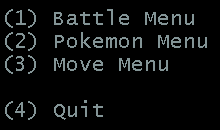

A simple C++ terminal application that simulates Pokémon battles.

Game modes:
Player vs Player
Player vs Computer
Computer vs Computer

A command that creates an executable:
g++ -o main main.cpp ui/*.cpp logic/*.cpp data/*.cpp models/*.cpp -std=c++11

After you've created that executable (which is called main) you run that file to see the program in action.

The following website provides the method used during damage calculation:
https://bulbapedia.bulbagarden.net/wiki/Damage

The following website was used as a reference to give created Pokémon correct stats with 252 252 6 EVs distributed accordingly:
http://www.psypokes.com/dex/stats.php

**Screenshots**

```bash
Main Menu
```

```bash
Battle Menu
```

```bash
Player vs Computer Battle
```

```bash
Computer vs Computer Battle
```

```bash
Pokémon Menu
```

```bash
Show All Pokémon
```

```bash
Move Menu
```

```bash
Show All Moves
```
